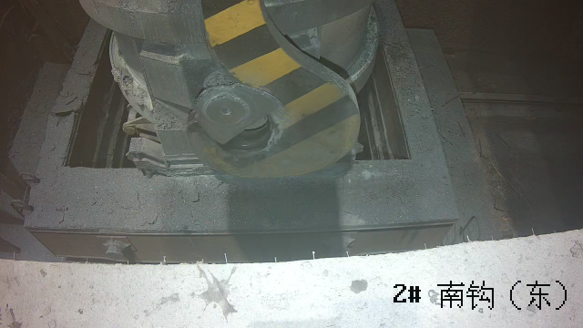
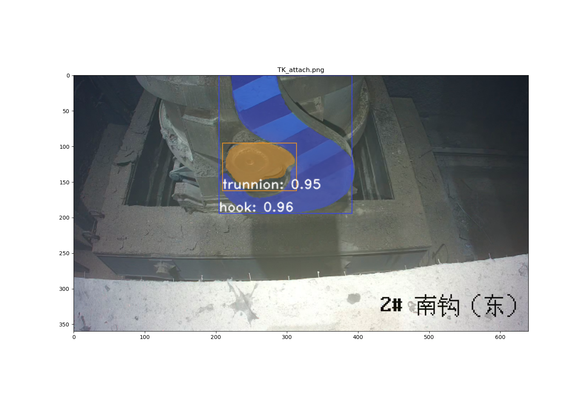

# yolact++
### 安装环境
pip install pillow==6.2.2  
pip install cython numpy opencv-python matplotlib pycocotools  
pip install torch==1.9.0+cu111 torchvision==0.10.0+cu111 torchaudio==0.9.0 -f https://download.pytorch.org/whl/torch_stable.html  
到DCNv2文件夹下，编译安装DCN：  
cd external/DCNv2
python setup.py build develop
### 测试demo程序文件
./test.py  
读取["TK_attach.png"](TK_attach.png)  
  
渲染后显示:  
  
